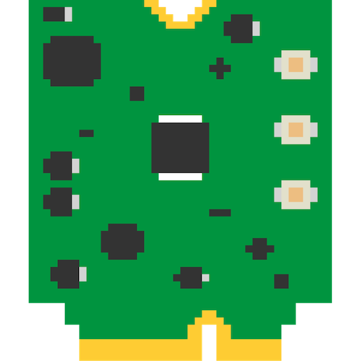
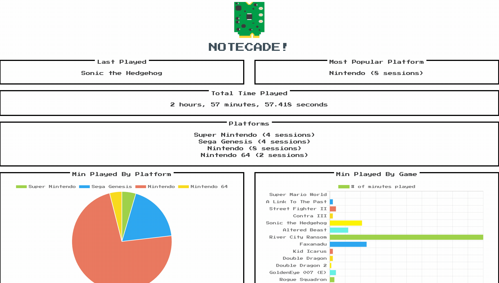

# Notecade

  

Complete source for a Raspberry Pi, [Notecard](https://blues.io) and [Notehub.io](https://notehub.io)-based retro-gaming monitor. The [full project writeup is on Hackster.io](https://www.hackster.io/brandonsatrom/).

This repository contains the complete source for the Notecade project, including:

- [Configuration scripts](picade-scripts/notecard-monitor) for interfacing with the Notecard from a Raspberry Pi-based [Pimoroni Picade system](https://shop.pimoroni.com/products/picade?variant=29210087489619) and scripts for
forwarding game [start](picade-scripts/event-scripts/runcommand-onstart.sh) and [end](picade-scripts/event-scripts/runcommand-onend.sh) event data to the
Notecard.
- Azure Functions for [storing game data](functions/notecade-functions/saveGameData/index.js) in CosmosDB, and [retrieving game data](functions/reindeerFunctions/getGameData/index.js) for the web dashboard.
- A [Svelte and Chart.js app](dashboard/) for displaying Notecade game charts and graphs.

## Other Resources

- [Blues Wireless Developer Portal](https://dev.blues.io)
- [Blue Wireless Forum](https://discuss.blues.io)
- [Blues Wireless on Twitter](https://twitter.com/blueswireless)